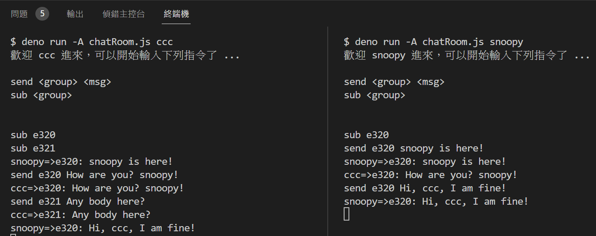

# chatRoom.js



```
$ deno run -A chatRoom.js ccc
歡迎 ccc 進來，可以開始輸入下列指令了 ...

send <group> <msg>
sub <group>


sub e320
sub e321
snoopy=>e320: snoopy is here!
send e320 How are you? snoopy!
ccc=>e320: How are you? snoopy!
send e321 Any body here?
ccc=>e321: Any body here?
snoopy=>e320: Hi, ccc, I am fine!
```

```
$ deno run -A chatRoom.js snoopy
歡迎 snoopy 進來，可以開始輸入下列指令了 ...

send <group> <msg>
sub <group>


sub e320
send e320 snoopy is here!
snoopy=>e320: snoopy is here!
ccc=>e320: How are you? snoopy!
send e320 Hi, ccc, I am fine!
snoopy=>e320: Hi, ccc, I am fine!
```
