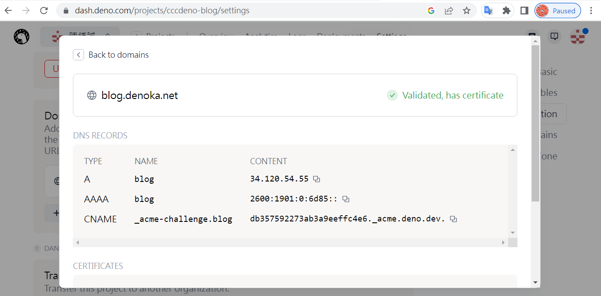

# deno deploy

上 https://deno.com/deploy ，註冊帳號後，用 github 建立一個專案，綁定後既可啟動。

## Blog Demo

* https://cccdeno-blog.deno.dev/

* https://cccdeno-blog-pqv7kshddj0g.deno.dev/
    * https://dash.deno.com/projects/cccdeno-blog
    * https://github.com/cccdeno/denoDeployBlog/

## 綁定 blog.denoka.net

若要綁定自己的網域名稱，請將 A  / AAAA / CName 資訊加入 denoka.net 的 dns 紀錄中

