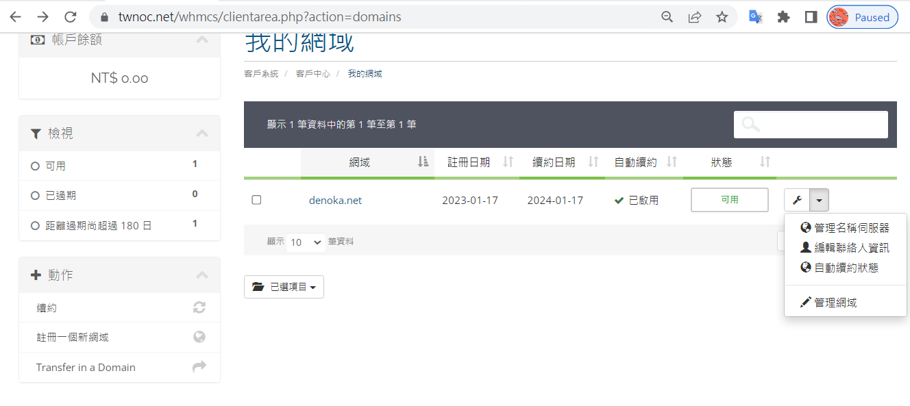
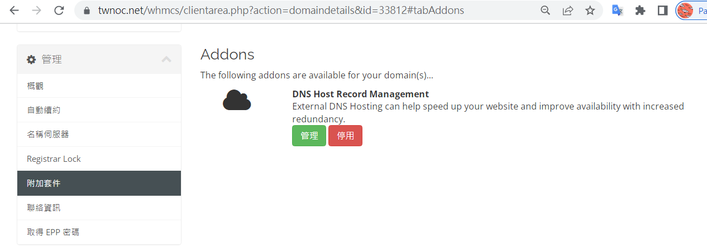
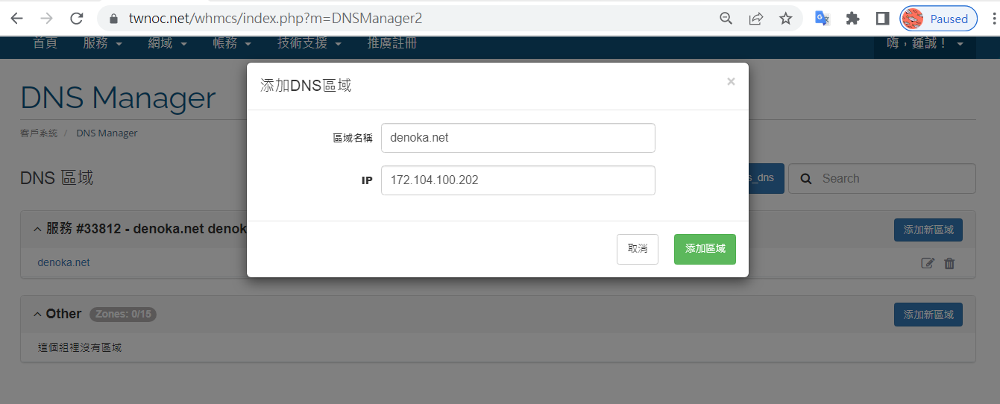
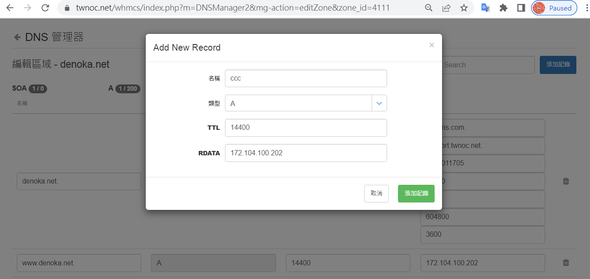
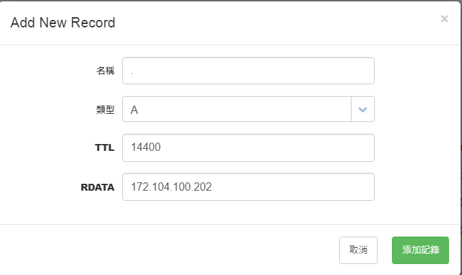

# 遠振資訊的 Domain Name

前幾年我都向 gandi 購買網域名稱，2023 年 1/17 我想購買 denoka.net 網域名稱，發現 gandi 上報價 NT$630，而台灣的遠振資訊只要  NT$ 480，所以我就改向遠振購買。 

* [遠振資訊](https://host.com.tw/)
    * [網域註冊](https://host.com.tw/%E7%B6%B2%E5%9F%9F%E8%A8%BB%E5%86%8A)

買好繳費完之後選擇《網域/我的網域》，然後選擇 我購買的網域 denoka.net 上最右邊的螺絲起子圖示，選《管理網域》。



這時會看到以下資訊


但是遠振提供的 dns 服務預設沒有啟動，你必須去《附加套件》中將之啟動



啟動完畢之後，可以參考遠振的 DNS 中文教學，這點比法國廠商 gandi 親切不少。

* [DNS 與 DNS server 是什麼? 申請免費 DNS 管理設定教學](https://host.com.tw/DNS)

然後你就可以到《網域/DNS代管》去



接著按《編輯區域》可進入設定畫面，選《添加紀錄》可以加入子網域。

由於我剛剛已經添加了 www 這個子網域，現在改添加 ccc 這個子網域做示範。



添加好通常立刻生效，您可以用 ping 測試看看：

```
ccckmit@asus MINGW64 /d/ccc
$ ping www.denoka.net

Ping www.denoka.net [172.104.100.202] (使用 32 位元組的資料):
回覆自 172.104.100.202: 位元組=32 時間=73ms TTL=48
回覆自 172.104.100.202: 位元組=32 時間=108ms TTL=48

172.104.100.202 的 Ping 統計資料:
    封包: 已傳送 = 2，已收到 = 2, 已遺失 = 0 (0% 遺失)，
大約的來回時間 (毫秒):
    最小值 = 73ms，最大值 = 108ms，平均 = 90ms
Control-C

ccckmit@asus MINGW64 /d/ccc
$ ping ccc.denoka.net

Ping ccc.denoka.net [172.104.100.202] (使用 32 位元組的資料):
回覆自 172.104.100.202: 位元組=32 時間=104ms TTL=48
回覆自 172.104.100.202: 位元組=32 時間=93ms TTL=48

172.104.100.202 的 Ping 統計資料:
    封包: 已傳送 = 2，已收到 = 2, 已遺失 = 0 (0% 遺失)，
大約的來回時間 (毫秒):
    最小值 = 93ms，最大值 = 104ms，平均 = 98ms
Control-C
```

然後可以用瀏覽器開啟 http://ccc.denoka.net ，就會發現連上我的 linode 主機了。

其實這就只是將 ccc.denoka.net 映射到 172.104.100.202 ，結果和 http://172.104.100.202 是一樣的。

如果你要添加根目錄，也就是沒有 subdomain 的那個，請在名稱上直接打 . 就可以了。


