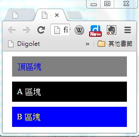

## CSS 網頁排版語言

### CSS 簡介

我們可以透過 HTML 的表格排出某些格式，但是卻很難讓整個頁面足夠美觀。

舉例而言，假如我們想讓表格的標頭欄以黑底白字的方式顯示，那麼就得靠 CSS 來幫忙了。

CSS 是 Cascading Style Sheets 的簡稱，中文可翻譯為「串接樣式表」，CSS 主要是用來設定 HTML 的顯示版面，包含「字體、大小、顏色、邊框、背景」等等，一個好的 CSS 可以讓您的網頁變得很美觀，而且不需要大幅修改網頁的內容，只要加入一個 CSS 引用即可。

當套用不同的 CSS 時，網頁的風格就可以產生完全不同的感覺，這讓你的網頁可以輕易的更換成不同的版型。事實上、當您在 blogspot 或 wordpress 網誌平台套用不同版型的時候，只不過是更換了 CSS 樣版而已。

在 HTML 當中，CSS 有兩種寫法，一種是內嵌式的寫法，另一種是外連式的寫法。

為了說明 CSS 的語法，先讓我們回顧一下，一個簡單沒有格式化的 HTML 表格，其寫法如下：

```html
<html>
<head><meta charset='utf-8'></head>
<body>
<table>
<tr><th></th><th>欄 1</th><th>欄 2</th></tr>
<tr><th>列 1</th><td>1,1</td><td>1,2</td></tr>
<tr><th>列 2</th><td>2,1</td><td>2,2</td></tr>
</table>
</body>
</html>
```

如果我們將上述表格的 th 部分，都加上 `style="background-color:black; color:white;"` 這樣的 CSS 語法，那麼我們就會得到一個黑底白字的表格。

```html
<html>
<head><meta charset='utf-8'></head>
<body>
<table>
<tr>
<th style="background-color:black; color:white;"></th>
<th style="background-color:black; color:white;">欄 1</th>
<th style="background-color:black; color:white;">欄 2</th>
</tr>
<tr>
<th style="background-color:black; color:white;">列 1</th>
<td>1,1</td>
<td>1,2</td>
</tr>
<tr>
<th style="background-color:black; color:white;">列 2</th>
<td>2, 1</td>
<td>2, 2</td>
</tr>
</table>
</body>
</html>
```

我們使用 CSS 排版前與排版後的結果可以對照如下：


您可以看到在這種寫法當中，我們幾乎都一直在 th 重複撰寫 `style="background-color:black; color:white;"` 這一行文字，總共重複了 5 次，這顯然是很浪費時間的行為。

如果我們可以改用統一的方式，寫出「對於所有 th 而言，我都要用 background-color:black; color:white; 這樣的方式顯示」那不就簡單多了嗎？

是的、CSS 確實可以讓您這樣做，讓我們將上述範例修改成統一設定格式的版本，如下所示。

```html
<html>
<head>
<meta charset='utf-8'>
<style>
th { background-color:black; color:white; }
</style>
</head>
<body>
<table>
<tr><th></th><th>欄 1</th><th>欄 2</th></tr>
<tr><th>列 1</th><td>1,1</td><td>1,2</td></tr>
<tr><th>列 2</th><td>2,1</td><td>2,2</td></tr>
</table>
</body>
</html>
```

上述統一將 CSS 寫在 `<head><style>...</style></head>` 裏的這種寫法，比起內嵌式的顯然簡短多了，這種寫法正是 CSS 的精華之所在。

但是、如果我們想要對整個網站的所有檔案，都套用同一種格式的話，那麼在每個 HTML 的頭部都要嵌入一整套 CSS 語法，那就不太方便了，萬一我們想要改變版面格式，不就每個 HTML 檔案都要更改，這顯然還不夠好用。

要解決這個問題，可以將表頭的 CSS 獨立到一個檔案中，然後再用連結的方式引用，這樣只要修改那個 CSS 檔案，整個網站的風格就跟著改變，所以上述檔案就可以改寫如下。


```html
<!DOCTYPE html>
<html>
<head>
<meta charset='utf-8'>
<link rel="stylesheet" type="text/css" href="mystyle.css">
</head>
<body>
<table>
<tr><th></th><th>欄 1</th><th>欄 2</th></tr>
<tr><th>列 1</th><td>1,1</td><td>1,2</td></tr>
<tr><th>列 2</th><td>2,1</td><td>2,2</td></tr>
</table>
</body>
</html>
```

檔案： mystyle.css

```css
th { background-color:black; color:white; }
```

透過這種方式，我們就可以為網頁設計統一的風格，也比較容易更換網頁的排版風格了，這就是 CSS 語法的用途了。

當然、上述的網頁還不夠好看，如果我們將 mystyle.css 修改如下，您就會發現表格變得好看多了。

```css
table { border-collapse: collapse; border: 1px solid #373737; }
th { background-color:black; color:white; padding:10px; margin:10px; }
td { padding:10px; margin:10px; }
```


### 路徑, tag, id 與 class

即使有了可以統一套用的方式，有時我們還是會感覺到不方便，舉例而言，如果我們想要對某個表格套上 A 格式，然後在對另一個表格套上 B 格式，這時採用上述方法就不太夠用了。

為了解決這種問題，HTML 發展出了 id 與 class 這兩個屬性，我們可以根據 id 或 class 的名稱分別套用不同的 CSS 樣式。

舉例而言，以下網頁中有兩個 div 框，我們可以分別為這兩個框套用不同的格式，其中 classA 前面加了點符號，成為「.classA」，代表要比對的是 class 屬性，如果想要比對的是 id 屬性，那麼就可以加上井字符號 # (像是範例中 #topbar 的情況)。

```html
<html>
<head>
<meta charset='utf-8'>
<style>
#topbar { background-color:gray; color:blue; padding:10px; margin:10px; }
.classA { background-color:black; color:white; padding:10px; margin:10px; }
.classB { background-color:blue; color:yellow; padding:10px; margin:10px; }
</style>
</head>
<body>

<div id="topbar">頂區塊</div>

<div class="classA">A 區塊</div>

<div class="classB">B 區塊</div>

</body>
</html>
```



到目前，我們可以看到有三種 css 的指定方式，也就是「標記 tag、代號 id 與類別 class」，可以用 CSS 來定位。事實上、這些指定方式還可以互相串接，以下是一些範例：

```css
.classA table { ... }               // 套用到 class="classA" 內部的 table 標記
#topbar { ....}                     // 套用到 id="topbar" 的元素上
table .classA a { .... }    // 套用到 table 內具有 class="classA" 類別裏的超連結 a 標記上。
```

更棒的是、這些選取方式之間還可以共用，只要利用逗點符號「,」 分隔就可以了，以下是一些範例：

```css
.classA, #topbar { ... }            // 套用到 class="classA" 或 id="topbar" 的元素上
#topbar a, .classA a { ....}        // 套用到 id="topbar" 或 class=".classA" 裏的 a 元素上
```

### 一個實用的 CSS 的範例

如果您想進一步學習 CSS 的各個屬性與用法，請參考下列網址，我們將不一一說明這些屬性的用法。

* http://www.w3schools.com/css/default.asp

在此、筆者將自己常用的一個 CSS 檔案列出，讀者觀察後可以自行複製修改使用。

```CSS
header, aside {
  position: fixed;
  left: 0;
  top: 0;
  background-color: #222222;
  color: #cccccc;
  text-decoration: none;
  text-align: left;
  white-space: nowrap;
  overflow: auto; /* hidden 超出界線的部分要隱藏 */
}

header {
  width: 100%;
  padding: 8px;
  z-index: 2;
}

header a, header a:visited, aside a, aside a:visited {
  color: #cccccc;
  text-decoration: none;
}

header .toggler {
  position:fixed;
  left:10;
  top:0;
  font-size:28px;
  z-index: 3;
} 

header .menu {
  position: fixed;
  text-align: right;
  padding-right: 0px;
  padding-left: 30px;
  right: 0;
  z-index: 3;
  background-color:#222222;
}

header .title {
  float: left;
  margin-left: 30px;
  white-space: nowrap;
  overflow: hidden;
}

aside {
  width: 0px;
  height: 100%;
  transition: width 0.5s;
  z-index: 1;
}

aside>div {
  padding: 50px 10px;
}

aside, aside *, aside a, aside a:visited {
  color: #cccccc;
}

aside ul, aside ol {
  margin: 10px 10px;
  padding: 0;
  list-style-type: none;
}

main {
  margin: 10 auto;
  padding: 50px 10px;
  max-width: 800px;
  /* border: 1px #aaaaaa solid; */
}

main a, main a:visited {
  text-decoration: none;
  color: #336699;
}

html {
  overflow-y: scroll;
}

body {
  margin: 0;
}

pre {
  padding: 10px;
  background-color: #dddddd;
  border: 1px black solid;
}

table, form, p, li {
  line-height: 160%;
}

h1, h2, h3 {
  font-family: '標楷體', 'Times New Roman'
}


h1, h2, h3, h4, h5, h6 {
  margin: 8px 0px;
  padding: 8px 0px;
}

h1 {
  color: #000000;
  /* margin-bottom: 16px; */
}

h2 { color: #666666; }

h1 { font-size: 200%; }
h2 { font-size: 160%; }
h3 { font-size: 140%; }
h4 { font-size: 120%; }
h5 { font-size: 110%; }
h6 { font-size: 100%; }

blockquote {
  border: 1px #aaaaaa solid;
  padding: 5px 10px;
}

figcaption {
  text-align: center;
}

table {
  /* margin: 10 auto; */
  border: 1px #888888 solid;
  border-collapse: collapse;
}

td, th {
  padding: 8px;
  border: 1px #888888 solid;
}

th {
  background-color: #222222;
  color: #f0f0f0;
}

form {
  margin: 10 auto;
  width: fit-content;
}

textarea {
  padding: 10px;
  width: 95%;
  height: 400px;
  border: 1px black solid;
}

button, input {
  height: 28px;
}

button {
  padding: 5px;
  border-radius: 3px;
  border: 1px black solid;
  vertical-align: bottom;
}

textarea.wide {
  width: 700px;
}

@media only screen and (max-width: 700px) {
  textarea.wide {
    width: 400px;
  }
}

```

### 參考文獻
* http://www.w3schools.com/css/default.asp
* http://css.maxdesign.com.au/listutorial/
* [CSS可樂](http://csscoke.com/)
* [CSS overflow 屬性用法](http://www.wibibi.com/info.php?tid=157)
* [Expand a div to take the remaining width](http://stackoverflow.com/questions/1260122/expand-a-div-to-take-the-remaining-width)
