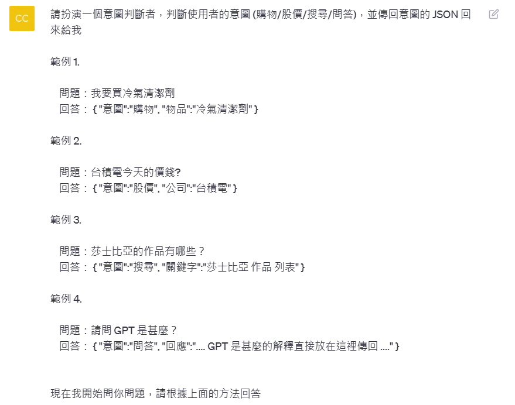
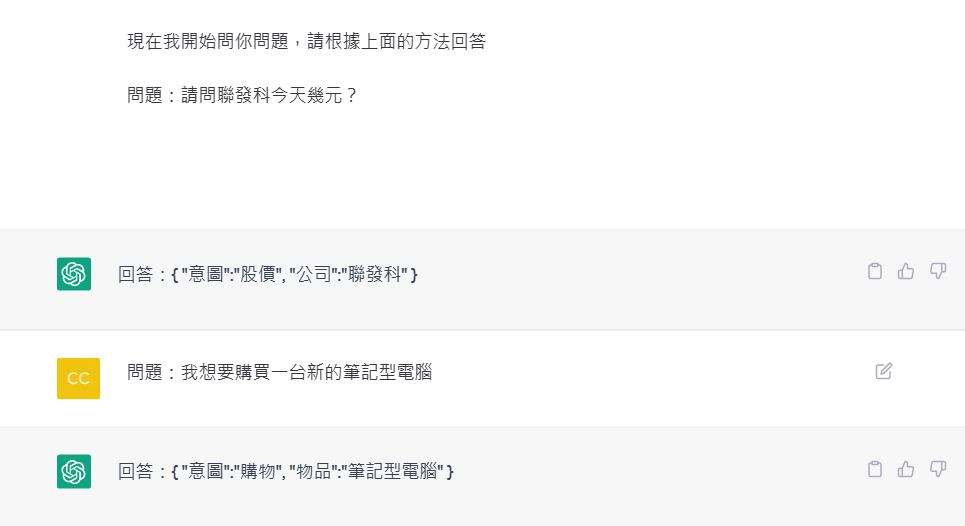
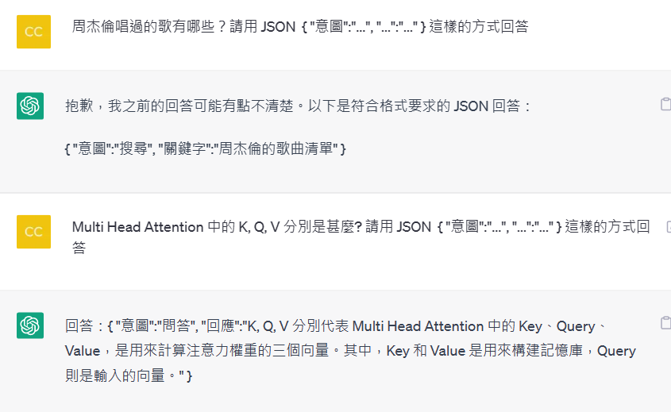

# chatExample

## 問答紀錄

請扮演一個意圖判斷者，判斷使用者的意圖 (購物/股價/搜尋/問答)，並傳回意圖的 JSON 回來給我

範例 1. 

    問題：我要買冷氣清潔劑
    回答： { "意圖":"購物", "物品":"冷氣清潔劑" }

範例 2. 

    問題：台積電今天的價錢?
    回答： { "意圖":"股價", "公司":"台積電" }

範例 3. 

    問題：莎士比亞的作品有哪些？
    回答： { "意圖":"搜尋", "關鍵字":"莎士比亞 作品 列表" }

範例 4. 

    問題：請問 GPT 是甚麼？
    回答： { "意圖":"問答", "回應":".... GPT 是甚麼的解釋直接放在這裡傳回 ...." }

現在我開始問你問題，請根據上面的方法回答

## 問題：請問聯發科今天幾元？

回答：{ "意圖":"股價", "公司":"聯發科" }

## 問題：我想要購買一台新的筆記型電腦

回答：{ "意圖":"購物", "物品":"筆記型電腦" }

## Multi Head Attention 中的 K, Q, V 分別是甚麼?

K, Q, V 是 Multi Head Attention (多頭注意力) 中的三個矩陣，其分別代表 Key、Query、Value。

在多頭注意力機制中，會同時使用多個注意力機制，因此會將輸入的 K、Q、V 矩陣先分成多個頭 (Head)，分別進行注意力機制的運算，最後再將多個頭的結果合併起來。每個頭所使用的 K、Q、V 矩陣都是由原始的 K、Q、V 矩陣經過線性轉換得到的，這些線性轉換是由學習可調整的權重參數所決定。

簡單來說，K、Q、V 在 Multi Head Attention 中的作用如下：

K (Key) 矩陣：用來計算輸入序列中每個詞對應的權重。
Q (Query) 矩陣：用來計算與輸入序列中每個詞相關的權重。
V (Value) 矩陣：用來將計算得到的權重與原始輸入序列中的詞向量進行加權平均，得到注意力機制的輸出。

## 周杰倫唱過的歌有哪些？

回答：這個問題屬於搜尋類型的問題，可以透過搜尋引擎或是歌曲資料庫查詢周杰倫唱過的歌曲。以下是一些周杰倫的代表作品：

* 不能說的祕密
* 簡單愛
* 告白氣球
* 晴天
* 青花瓷
* 七里香
* 蒲公英的約定
* 夜曲
* 以父之名
* 安靜

當然，這裡僅列出了一些較為知名的作品，周杰倫的歌曲數量非常龐大，詳細清單可以透過搜尋獲取。

## 請用 JSON  { "意圖":"搜尋", "關鍵字":"..." } 這樣的方式回答

回答：{ "意圖":"搜尋", "關鍵字":"周杰倫的歌曲清單" }

## 周杰倫唱過的歌有哪些？

周杰倫唱過的歌曲列表

## 周杰倫唱過的歌有哪些？請用 JSON  { "意圖":"...", "...":"..." } 這樣的方式回答

抱歉，我之前的回答可能有點不清楚。以下是符合格式要求的 JSON 回答：

{ "意圖":"搜尋", "關鍵字":"周杰倫的歌曲清單" }

## Multi Head Attention 中的 K, Q, V 分別是甚麼? 請用 JSON  { "意圖":"...", "...":"..." } 這樣的方式回答

回答：{ "意圖":"問答", "回應":"K, Q, V 分別代表 Multi Head Attention 中的 Key、Query、Value，是用來計算注意力權重的三個向量。其中，Key 和 Value 是用來構建記憶庫，Query 則是輸入的向量。" }

